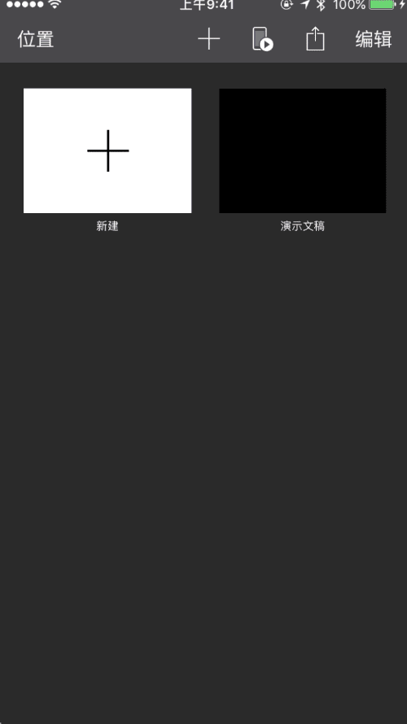

# FVCustomTransition

This library will teach us to achieve very cool transition effect, if you have mastered the skills, you can create exciting products.

FVCustomTransition introduces a correct and general solution to perform viewControllers transitions When we do some cool transition effect, like what Apple did in their Numbers Pages Keynote apps:

## Introduction

FVCustomTransition provides a few examples of transition, the show is as follows, through the realization of these transition effects can make our controller to switch more smoothly and personality, but also help us achieve some cool effect, to some extent To enhance the user experience.

### first Example

### second Example

coding....

### third Example

coding...

## Requirements

iOS 8.0 or above. May be working from iOS 7.0, but I haven't tested it.

## License

FVCustomTransition is available under the MIT license. See the LICENSE file for more info.
