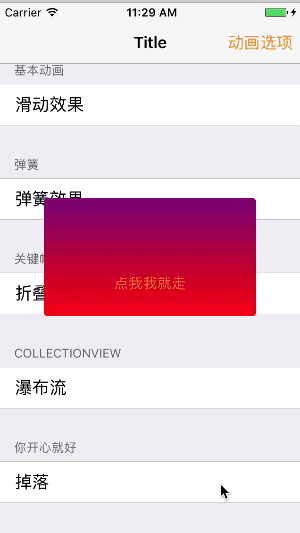

# FVCustomTransition

This library will teach us to achieve very cool transition effect, if you have mastered the skills, you can create exciting products.

## Introduction

FVCustomTransition provides a few examples of transition, the show is as follows, through the realization of these transition effects can make our controller to switch more smoothly and personality, but also help us achieve some cool effect, to some extent To enhance the user experience.

### First Example

Example 1 shows how we can set the transition duration and the direction of the controller to switch when the controller is switched(push&modal).

### Second Example

Example 2 has all of the characteristics of one example, in addition to the effect of the spring, in which the spring effect on the length of time, damping coefficient, ejection rate can be free to change

### Third Example

Example 3 Since the time required to display the folding effect differs greatly from the time required for the basic transition, the duration of the animation is separated in Example 3, and the transition time of the entire folding effect can be independently set

### Forth Example

## Requirements

iOS 8.0 or above. May be working from iOS 7.0, but I haven't tested it.

## License

FVCustomTransition is available under the MIT license. See the LICENSE file for more info.
